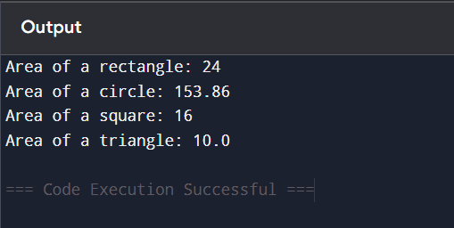

# 🐍 Python OOP: Abstract Class & Method Example

## 🎯 AIM

To create an **abstract class** named `Shape` with an **abstract method** `calculate_area`, and implement this method in two subclasses: `Rectangle` and `Circle`.

---

## 🧠 ALGORITHM

1. **Import ABC module**:
   - Use `from abc import ABC, abstractmethod` to define abstract classes and methods.

2. **Create Abstract Class `Shape`**:
   - Define an abstract method `calculate_area()` with `@abstractmethod`.

3. **Create Subclass `Rectangle`**:
   - Set default values for `length` and `breadth`.
   - Override `calculate_area()` to compute the rectangle area.

4. **Create Subclass `Circle`**:
   - Set default value for `radius`.
   - Override `calculate_area()` to compute the circle area.

5. **Create Objects & Call Methods**:
   - Instantiate `Rectangle` and `Circle`.
   - Call their `calculate_area()` methods.

---

## 💻 Program
```
from abc import ABC
class type_shape(ABC): 
    def area(self):
        pass
class Rectangle(type_shape):
    length = 6
    breadth = 4
    def area(self):
        return self.length * self.breadth
class Circle(type_shape):
    radius = 7
    def area(self):
        return 3.14*self.radius**2
class Square(type_shape):
    length = 4
    def area(self):
        return self.length**2
class triangle(type_shape):
    length = 5
    width = 4
    def area(self):
        return 0.5*self.length*self.width 
r = Rectangle()
c = Circle() 
s = Square() 
t = triangle() 
print("Area of a rectangle:", r.area())
print("Area of a circle:", c.area()) 
print("Area of a square:", s.area()) 
print("Area of a triangle:", t.area())
```
## Output

## Result
Thus the program to create an abstract class named Shape with an abstract method calculate_area, and implement this method in two subclasses: Rectangle and Circle is executed successfully.