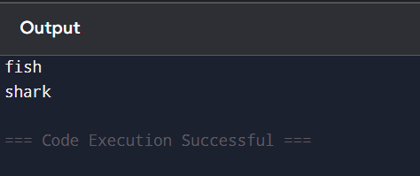

# 🐟 Method Overriding-Fish and Shark Class Inheritance in Python

## 🧠 AIM:
To write a Python program that demonstrates class inheritance by creating a parent class `Fish` with a method `type`, and a child class `Shark` that overrides the `type` method.

## 📋 ALGORITHM:

1. Define the `Fish` class with a method named `type()` that prints `"fish"`.
2. Define the `Shark` class as a subclass of `Fish`, and override the `type()` method to print `"shark"`.
3. Create an instance of the `Fish` class named `obj_goldfish`.
4. Create an instance of the `Shark` class named `obj_hammerhead`.
5. Use a `for` loop to iterate over both objects.
6. Within the loop, call the `type()` method using the loop variable.
7. Output will demonstrate method overriding: printing `"fish"` and `"shark"` accordingly.

## 💻 PROGRAM:
```
class Fish:
    def type(self):
        print("fish")
class Shark(Fish):
	def type(self):
	    print("shark")
obj_goldfish=Fish()
obj_hammerhead=Shark()
obj_goldfish.type()
obj_hammerhead.type()
```
## OUTPUT

## RESULT
Thus the program that demonstrates class inheritance by creating a parent class Fish with a method type, and a child class Shark that overrides the type method is executed successfully.